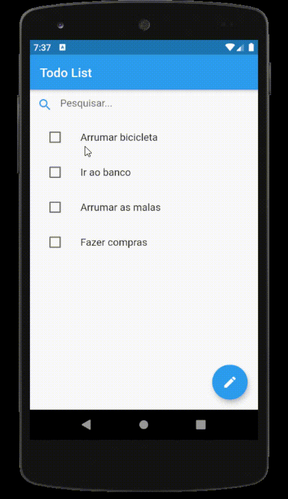

# Flutter Exam

Flutter entrance exam for the Estudo Completo Project.

To acomplish the test you must build a Todo List Flutter App. 
In the app, the user should be able to create and delete tasks, to set them as completed, and filter the list with the task containing some text. 
The main screen must have the Todo List, a text field to filter the list and a button to go to the Edit Todo List screen. Each Todo must have its checkbox in order to set them completed. 
The Edit Todo List screen must have a text field where the user may enter a new task, a button to insert the task into the list and the list itself. The list must contain a delete button in each row.

Skills that will be assessed:
    1 - Building reusable components;
    2 - Screen layout and design;
    3 - State manegement;
    4 - Code architecture and structure.

Do only what you are asked for, but give your best, like the app was been made for a client. 
when finished, send the test to your git repo and send me the link by e-mail.

  

### Business rules:

> - A task has a text and a flag indicating completion 
> - Two items must not have the same text 
> - Items must not be empty 
> - New items should be inserted into the top of the list 
> - New items should be incompleted

 

### App rules:

> - The text input field must be reusable; 
> - The text input component must be used in both screens; 
> - The project must be structured as part of a big project, with separation of concerns; 
> - Do not build any persistence; 
> - Screen must not have any business logic. 

 

### Text input component rules:
> - It must have a leading icon, which may be passed as parameter;  
> - It must have a hint text, which may be passed as parameter;  
> - If there is any text writen, the component must show an "X" at the end of its line;  
> - When the "X" is pressed, the text inside the component must be cleaned;  
> - The component must not be focused at the beginning;  
> - The component must allow its text to be cleanned by an external controller or screen;  
> - The component must allow its text to be captured by an external controller or screen;

  

## Screens

### Screen 1

The search text field must always be at the top of the screen. 
The list may be filtered by all occurences containing the text (case insensitive). 
The search field must not have its content automatically cleanned even when there is navigation. 
If the list changes, it must be the updated results, considering the contens of the search text field. 

### Screen 2

The text field must always be at the top of the screen. 
When a new Todo is inserted, the input text must be cleanned. 

### Exemplo:

