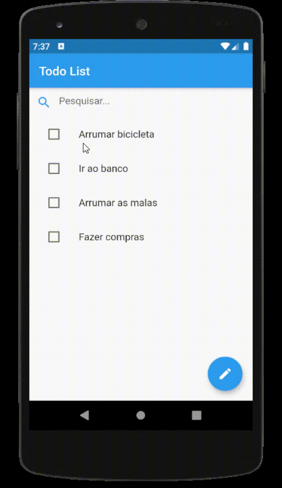

# Teste Flutter

Teste do exame para avaliação dos candidatos para o Projeto Flutter na Estudo Completo.

Para o teste deve ser criado um aplicativo que contenha uma lista de afazeres (Todo List). 
O aplicativo deve permitir criar novas tarefa, excluir tarefas existentes, marcar as tarefas já completas e filtrar a lista de tarefas por um campo de texto. 
Na tela inicial deve ser apresentada a lista de 'Todos' existentes, um campo de entrada de texto para filtrar a lista e um botão para ir para a tela de edição da lista. 
Na tela de edição da lista deve existir um campo de texto para escrever um novo 'Todo' com um botão para inserí-lo. Deve existir uma lista com todos os 'Todos' existentes, com um ícone de deleção ao final da linha de cada um.

O teste visa verificar as seguintes capacidades:

    1 - Criação de componentes reutilizáveis;
    2 - Design de layout de tela;
    3 - Gerenciamento de estado;
    4 - Estrutura e arquitetura do código.

    
Faça somente o necessário, mas dê o seu melhor, como se este app fosse para um cliente. 
Após finalizar, o projeto deve ser enviado para seu repositório git. Envie o link do seu repositório por e-mail. 

  

### Regras de negócio:
> - Uma tarefa possui um texto e um indicador para saber se já foi finalizada 
> - Não pode haver dois itens com o mesmo texto na lista 
> - Não pode haver item em branco 
> - Novos itens entram no início da lista 
> - Novos itens entram com indicador de finalização desligado

 

### Regras do app:

> - Deve ser criado um componente reutilizável para entrada de texto; 
> - O componente criado deve ser utilizado para entrada de texto nas duas telas; 
> - O projeto deve ser estruturado como se fosse parte de um projeto maior, contendo separação de responsabilidades entre arquivos; 
> - Não criar persistência de dados; 
> - As telas não devem conter lógica de negócio. 

 

### Regras do componente de entrada de texto:
> - Deve ter um ícone no início que pode ser informado via parâmetro;  
> - Deve ter um texto de ajuda (hint) que pode ser informado via parâmetro;  
> - Quando houver algum texto, deve aparecer um ícone "X" no final dele;  
> - Ao clicar no "X", o conteúdo deve ser limpo;  
> - O componente nunca deve iniciar já selecionado (com foco);  
> - Deve permitir ter seu texto limpo pela tela onde se encontra ou pelo controlador dela;  
> - Deve permitir que seu texto seja capturado pela tela onde se encontra ou pelo controlador dela.

  

## Telas

### Tela 1

O campo de pesquisa deve ficar fixo no topo da tela. 
Deve permitir filtrar os todos contendo o texto digitado no campo de pesquisa (case insensitive). 
O campo de pesquisa deve permanecer preenchido mesmo quando houver mudança de tela. 
Quando a lista for editada, deve exibir os resultados atualizados, levando em consideração o campo de pesquisa que pode já estar preenchido. 

### Tela 2

O campo de texto deve ficar fixo no topo da tela. 
Ao inserir um 'Todo' o campo de texto deve ser limpo. 

### Exemplo:

